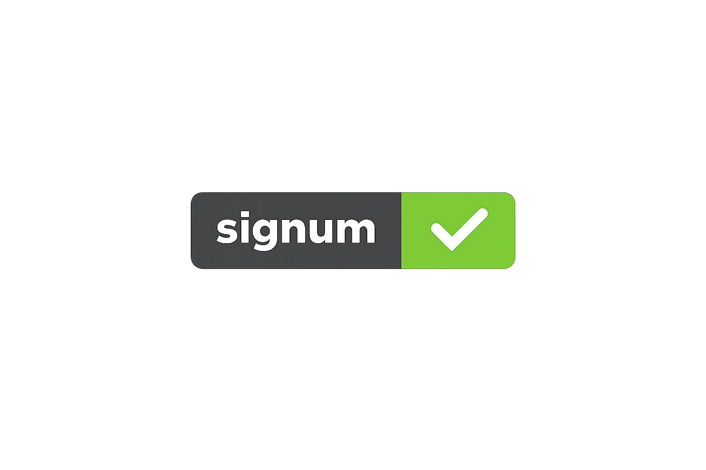

<h1 style="margin:0; padding:0;">
  
</h1>

**signum** is a badge generator that produces clean SVG status badges for READMEs, docs, and CI pipelines. It ships a CLI for local rendering, a small Go renderer package, and a self‑hosted API for stored, updateable badges.

- **CLI**: render badges locally to stdout or file.
- **Library**: use `pkg/renderer` in your own Go apps.
- **API**: create/update/delete stored badges or render one‑offs with the live endpoint.

Built on top of [`narqo/go-badge`](https://github.com/narqo/go-badge).

## ✨ Features

- 🎨 Named and hex colors with multiple styles (flat, flat-square, plastic)
- 🔐 Token-protected update/delete for stored badges
- ⚡ Fast SVG rendering with a tiny Go package
- 🧩 Live rendering endpoint for quick, no‑storage badges

## 🐳 Deploy with Docker Compose

1) Create a `.env` file (example):

```env
SIGNUM_POSTGRES_USER=signum
SIGNUM_POSTGRES_PASSWORD=signum
SIGNUM_POSTGRES_DBNAME=signum
SIGNUM_SECRET_KEY=change-me
SIGNUM_FONT_PATH=/absolute/path/to/your/font.ttf
```

2) Start services:

```bash
docker compose up --build
```

3) The API will be available at `http://localhost` (port 80 by default).

## 🧰 CLI Usage

Render to a file:

```bash
go run ./cmd/cli \
  -font /path/to/font.ttf \
  -subject build \
  -status passing \
  -color green \
  -style flat \
  -out ./badge.svg
```

Render to stdout (omit `-out`):

```bash
go run ./cmd/cli \
  -font /path/to/font.ttf \
  -subject build \
  -status passing \
  -color green \
  -style flat > badge.svg
```

## 🌐 API Usage

Swagger UI is available at `/api/docs/`.

### 📌 Endpoints

| Method | URI | Summary |
|--------|-----|---------|
| POST | `/api/badges` | Create a badge |
| GET | `/api/badges/{id}` | Render a stored badge |
| GET | `/api/badges/{id}/meta` | Read badge metadata |
| PATCH | `/api/badges/{id}` | Patch a badge |
| DELETE | `/api/badges/{id}` | Delete a badge |
| GET | `/api/badges/live` | Render a live badge |

### ✅ Create a badge

```bash
curl -X POST http://localhost/api/badges \
  -H "Content-Type: application/json" \
  -d '{
    "subject": "build",
    "status": "passing",
    "color": "green",
    "style": "flat"
  }'
```

Response includes a `badge.id` and a `token`.

### 🖼️ Render a stored badge

```bash
curl "http://localhost/api/badges/{id}" > badge.svg
```

Optional overrides: `subject`, `status`, `color`, `style`.

### ✏️ Patch a badge

```bash
curl -X PATCH http://localhost/api/badges/{id} \
  -H "Authorization: Bearer {token}" \
  -H "Content-Type: application/json" \
  -d '{"status":"failing","color":"red"}'
```

### 🗑️ Delete a badge

```bash
curl -X DELETE http://localhost/api/badges/{id} \
  -H "Authorization: Bearer {token}"
```

### ⚡ Live badge (no storage)

```bash
curl "http://localhost/api/badges/live?subject=build&status=passing&color=green&style=flat" > badge.svg
```

## 🧩 Library Usage

```go
r, _ := renderer.NewRenderer("/path/to/font.ttf")
svg, _ := r.Render(renderer.Badge{
  Subject: "build",
  Status:  "passing",
  Color:   renderer.Color("green"),
  Style:   renderer.Style("flat"),
})
_ = os.WriteFile("badge.svg", svg, 0o600)
```

## 🔧 Configuration

Server configuration is controlled via env vars:

- `SIGNUM_ADDR` (default `:8080`)
- `SIGNUM_FONT_PATH` (required)
- `SIGNUM_SECRET_KEY` (required)
- `SIGNUM_POSTGRES_HOST`
- `SIGNUM_POSTGRES_PORT` (default `5432`)
- `SIGNUM_POSTGRES_USER`
- `SIGNUM_POSTGRES_PASSWORD`
- `SIGNUM_POSTGRES_DBNAME`
- `SIGNUM_POSTGRES_SSLMODE` (default `disable`)
